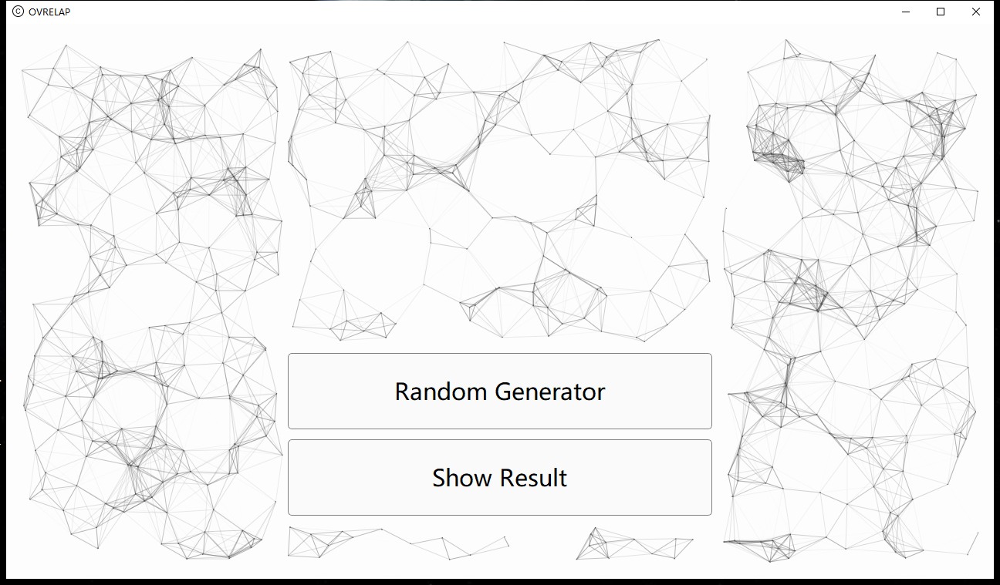
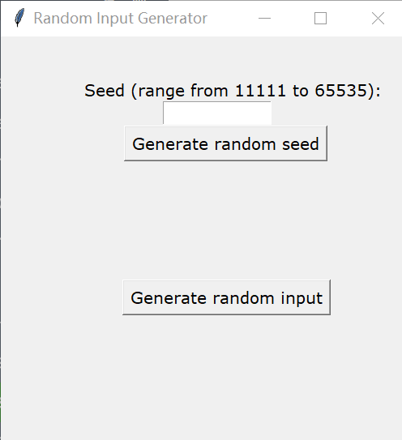
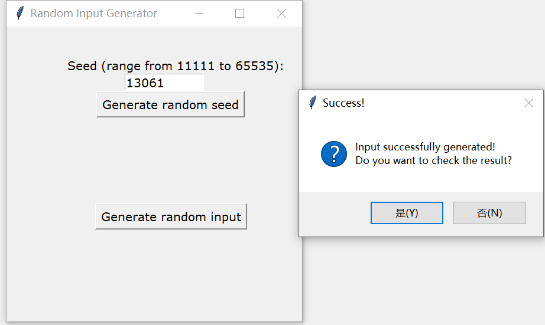
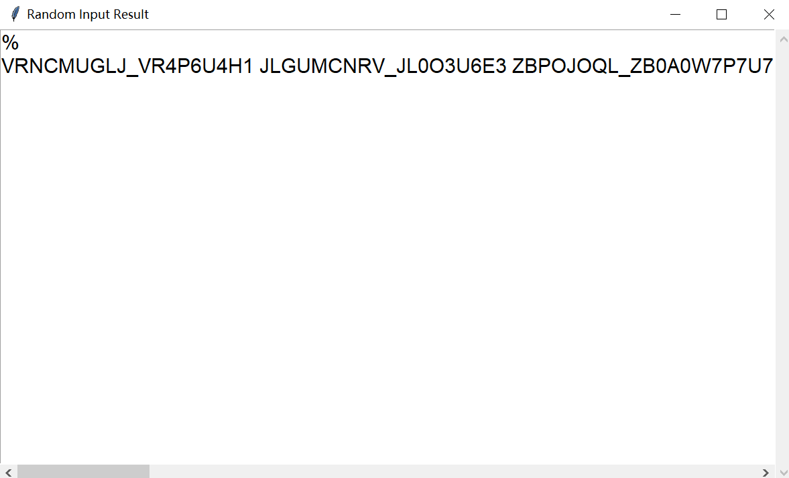
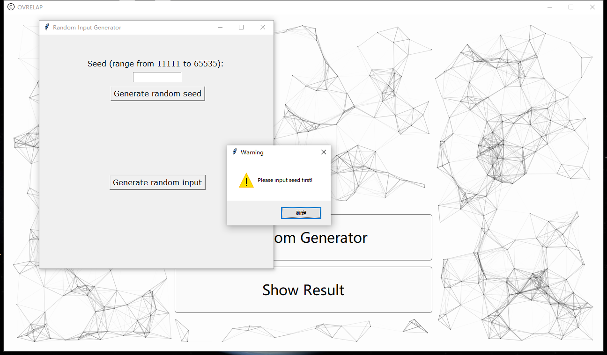
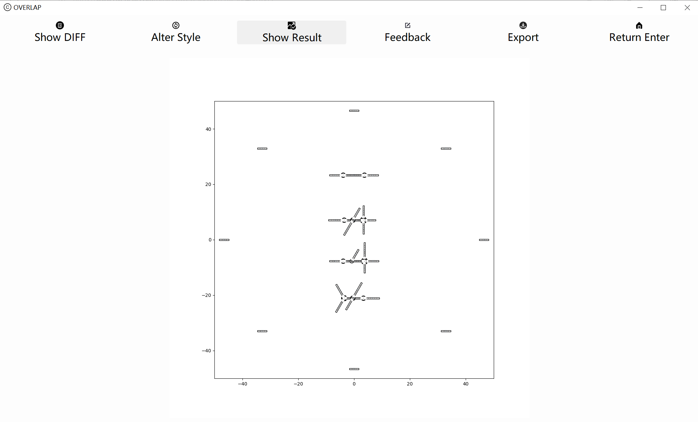
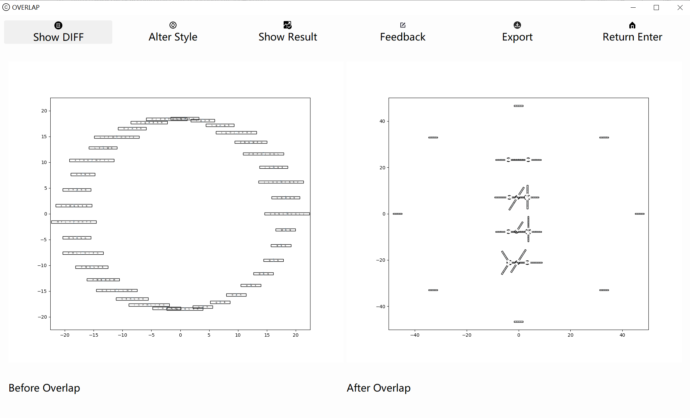
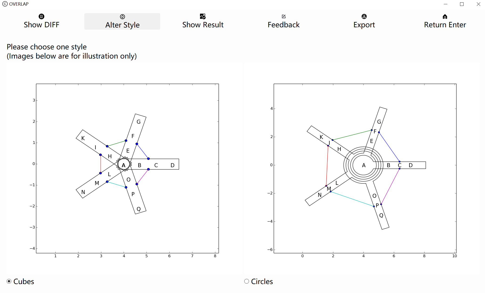
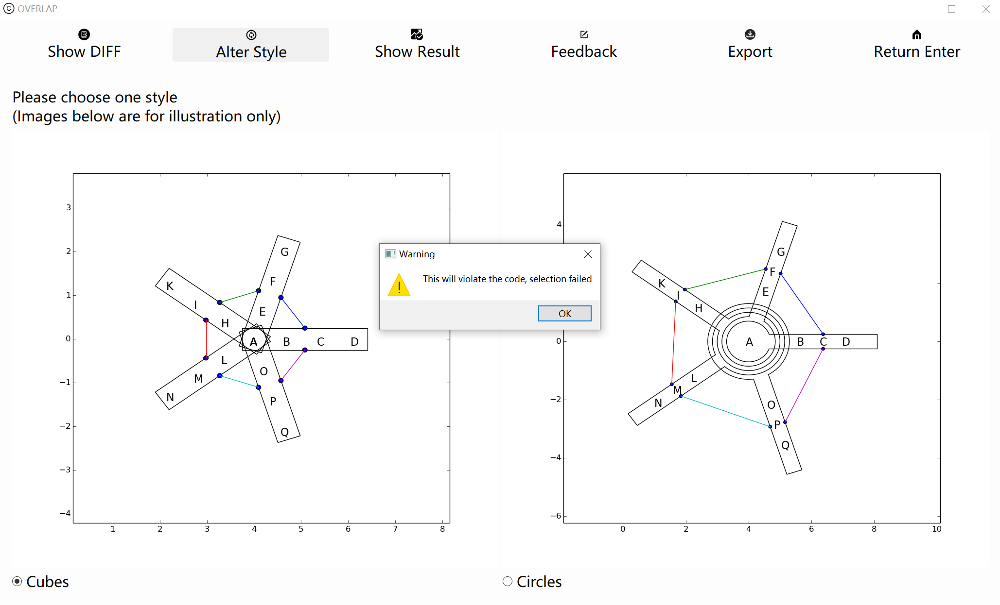
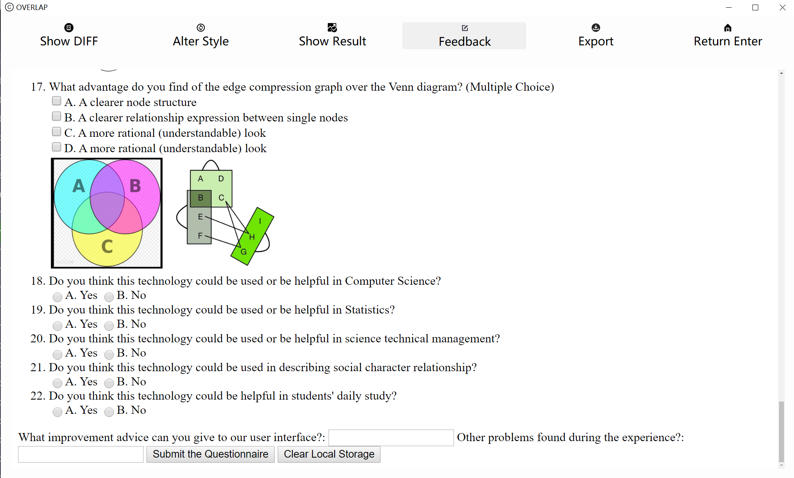

# User Manual
### Please do read the user manual before using this software!
This visualisation software is a tool that can translate English characters and numbers as input into nodes diagram. By using this software, the users could get simplified node diagrams, which can save their time and make their work more convenient.

## Environment requirements
 - operating system: windows only.
 - processor: Intel(R) Core(TM) i7-7590H, AMD R7-5800H or much powerful processor.

## Installation instruction
 - just run the 'Overlapping Node Visualisation.exe' and it can be opened.

## Homepage Interface
After opening the software, the user could be able to see this interface as homepage. There are two buttons as shown on the main interface: Random Generator and Show Result.  

  

We should always generate an input with limited format first. In this software, we use a random generator to input automatically.

## Random Generator Interface
After clicking 'Random Generator' button, the random generator could be accessed.  
   
So how do we use the random input generator.
* First, the user should input manually a random seed(range from 11111 to 65535) or just click 'Generate random seed' to input by the software. *The seed is used to randomize the input file.* 
* Then click the 'Generate random input', the software will automatically generate a txt file as input file. 
 
* Clicking 'Yes(Y)' and the input file could be shown but modification is forbidden. Whereas closing the generator if 'No(N)' is pressed.
 
***Attention***

Users should make sure that the random seed is not empty and in the valid range when clicking the 'Generate random input'. Because the random input file is related to the random seed. Or this warning could be shown.  

Users could see the visulisation diagram next if the above steps are followed.  

## Show Result Interface

The show result interface could be shown if clicking 'Show Result' button.  

There are six functions on the at the top of the interface: Show Diff, Alter Style, Show Result, Feedback, Export and Return Enter. And it pre-select ' Show Result'.

### Show Result

In this function, a frame in the center of the interface displays the image generated and simplified by the software. Users could use the mouse to move and zoom the diagram if they want. We use an algorithm to locate every node, and overlap the some nodes to make it more clear.  Repulsion and attraction forces are added between node and node, which avoids the diagram to be in a mess. What's more, nodes with no overlaps and nodes with overlaps on single letter will be default in cubes display pattern and nodes with overlaps on multiple letters will be default in circles display pattern. 

### Show Diff

In this function, the comparison of before and after overlap diagrams could be shown. The left side is the initial figure and the right one is the diagram after disposal by the algorithm. We can see a stark contrast and see how powerful our software is.  

### Alter Style

In this function, users could be able to change the style of the output diagram. We provide two different kinds of styles: one is cubes pattern and the other is circles pattern. Both patterns aim to change the display of overlaps to diversify the diagrams. Users can choose the pattern depends on what they like and click 'Show Result' bottom to check the diagram. What warns the users is that the diagram with overlaps on multiple letters cannot select cubes pattern because of complexity.  

### Feedback

In this function, we provide users with a feedback survey to optimize and improve our software. We sincerely hope that users can fill in the feedback after using the software.  

### Return Enter

This button can back to the homepage.

## Ending

This is the end of the user manual. Wish you have a wonderful experience on using this software.

